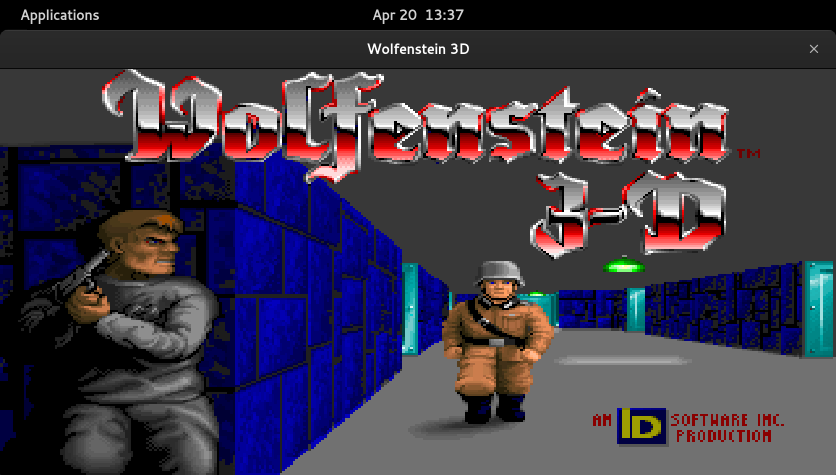

# Wolf3D module for OWD Client
> Wolfenstein 3D emulated with js-dos on Open Web Desktop

<p>
    
</p>

<p>
    <a href="LICENSE"></a>
    <a href="https://github.com/owdproject/owd-client"></a>
    <a href="https://github.com/topics/owd-modules"></a>
    <a href="https://hacklover.net/patreon"></a>
    <a href="https://hacklover.net/discord"></a>
</p>

## Demo
[Try it out](https://hacklover.net/client), just open the terminal and type "wolf3d"

## Overview
This module is an iframe that loads the original Wolfenstein 3D game using the [js-dos](https://github.com/caiiiycuk/js-dos) emulator. 
I chose to put Wolf3D in an iframe to keep OWD's code and resources lean, especially after closing the window.  

You can potentially create new modules and load different games simply by changing the path of the iframe.

## Quick install
- Move to your client folder, then
  ```
  # Install this module with Npm
  npm install hacklover/owd-app-wolf3d
  
  # Or using Yarn
  yarn add hacklover/owd-app-wolf3d
  ```
- Define this module in `owd-client/client.extensions.ts`
  ```js
  import AboutModule from "@owd-client/core/src/modules/app/about";
  import DebugModule from "@owd-client/core/src/modules/app/debug";
  import WolfensteinModule from "hacklover/owd-app-wolf3d/client";

  export default {
    app: {
      modules: [
        AboutModule,
        DebugModule,
        WolfensteinModule,
      ]
    },
    ...
  ```
- Copy the content of the [client/public](https://github.com/hacklover/owd-app-wolf3d/tree/master/client/public) folder into `owd-client/public`
- Download the game [from here](https://archive.org/details/Wolfenstein3d) and put it into `owd-client/public/js-dos/games/WOLF3D.zip`

## Compatibility
- Open Web Desktop client v2.0.0-beta.1

## License
This project is released under the [MIT License](LICENSE)